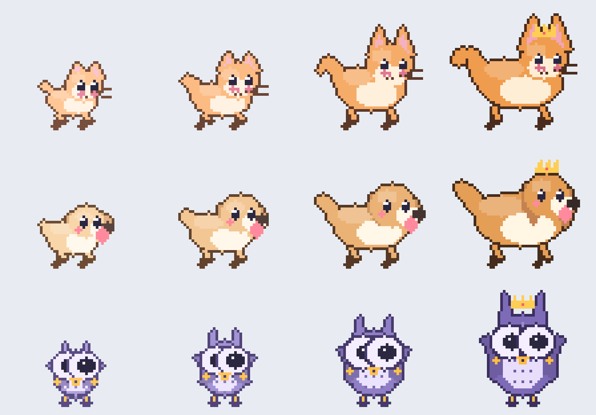

# 🐾 Pet Companion

A tiny pixel-art pet — **Inka** (cat) or **owl** — that lives at the bottom of
your browser, walks across the page, reacts when you click, lets you carry it
around, and **grows** the more you play with it.

Everything is drawn procedurally in code (no sprite-sheet assets), so the art
stays crisp at any size and the animals literally re-pixel themselves as they
level up: a big-headed pastel baby gradually becomes a balanced adult and then a
larger, richer-coloured elder with a glowing aura — and a crown at the top.



## Features

- **Four companions** — two drawn procedurally (**Inka** the cat, owl) plus two
  pixel-sprite cats (**Biscuit** and **Vampire Biscuit**) animated from real
  sprite sheets. Each has its own quirks (Inka's tail curl, owl wing-tuck;
  Biscuit tail-swishes and curls up in a **box** when it sleeps).
- **Lives on the page** — strolls along the bottom, pauses to sit, looks around,
  gets sleepy, blinks, and dozes off with little `z`'s.
- **Reacts to you** — click anywhere and it perks up and hops toward the click;
  click the pet to **pet** it (hearts!), or **drag** it anywhere on screen.
  **Press and hold** Biscuit and it hops into a box, playing that animation
  through all its frames and curling up until you let go.
- **Grows up** — earn XP by petting, feeding treats, and just browsing. Twelve
  levels from *Baby* → *Young* → *Adult* → *Elder* → *Mythic*, each visibly
  changing the pet's size, proportions, colours, aura, and sparkles.
- **Procedural motion** — physics-driven gait, vertical hops with
  squash-and-stretch, tail/ear sway, particle hearts & sparkles. No CSS
  keyframes; it's all `requestAnimationFrame`.
- **Popup control panel** — pick your friend, rename it, watch a live animated
  preview, feed treats, toggle visibility, and tune size & pace.
- **Never in your way** — the pet canvas never intercepts page clicks; only a
  small hit-area around the pet's body is interactive.

## Install (developer / unpacked)

1. Open `chrome://extensions` in Chrome (or Edge/Brave).
2. Turn on **Developer mode** (top-right).
3. Click **Load unpacked** and select this folder (the one with `manifest.json`).
4. Open any normal web page — your companion appears at the bottom-left. Click
   the toolbar icon to choose your animal and feed treats.

> Content scripts don't run on `chrome://` pages, the Chrome Web Store, or the
> PDF viewer, so the pet won't show there — that's expected.

## How growth works

| Source        | XP    | Notes                                   |
| ------------- | ----- | --------------------------------------- |
| Pet the pet   | +2    | once per minute                         |
| Feed a treat  | +6    | from the popup                          |
| Passive       | +1    | every couple of minutes browsing, capped daily |

XP is stored in `chrome.storage.local`, so your pet is the same across every tab
and syncs instantly when you change something in the popup.

## Project layout

```
manifest.json              MV3 manifest
src/lib/raster.js          indexed-palette pixel buffer + drawing primitives
src/lib/critters.js        procedural cat (Inka) / owl art + growth model
src/lib/spritecat.js       sprite-sheet companions (Biscuit / Vampire Biscuit) + loader
src/lib/storage.js         saved state + XP↔level curve (shared everywhere)
src/lib/pet.js             behaviour state-machine, physics, particles, renderer
src/assets/cat/            sprite sheets (Idle / drculacat / Box3, 32x32 strips)
src/content/content.js     injects & hosts the pet on every page
src/content/content.css    overlay styling (canvas + hit-area + speech bubble)
src/popup/                 control panel (HTML/CSS/JS)
src/background/background.js  service worker — passive XP via alarms
tools/gen-icons.js         renders toolbar icons from the same critter art
tools/preview.js           dev: render an art sheet to tools/preview.png
icons/                     generated PNG icons (16/48/128)
```

## Development

Regenerate the icons or the art preview after tweaking the critters:

```bash
node tools/gen-icons.js     # -> icons/icon{16,48,128}.png
node tools/preview.js       # -> tools/preview.png
```

Both reuse the *exact* same `raster.js` + `critters.js` the extension runs, so
the preview is a faithful render of what walks your pages.

## Credits

The Biscuit and Vampire Biscuit companions use sprites from the **CatPackFree**
asset pack (`src/assets/cat/`). Inka (cat) and the owl are original procedural art.

## Roadmap ideas

- Coat-colour variants per animal in the popup
- More animals (fox, bunny, dragon)
- Mini-interactions: throw a toy, the pet chases the cursor
- Optional name-tag and accessories unlocked by level
